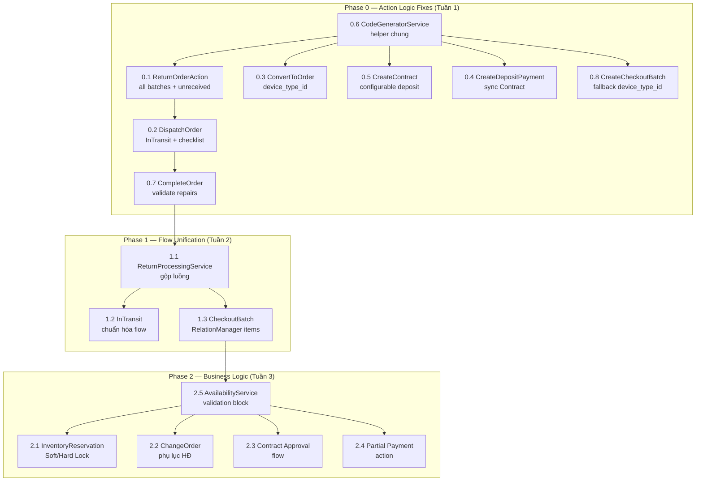

# 📋 Kế Hoạch Bổ Sung Toàn Bộ Logic Còn Thiếu — LED Manager

> **Phương pháp**: Đọc 4 docs `.docx` + `codegraph` phân tích 247 files + audit trực tiếp 15 action + model/enum/form/service.
> **Ngày**: 2026-08-28
> **Trạng thái hiện tại**: ~60% hoàn thành (22/37 models/resources đã có, widgets/reports cơ bản có, nhưng logic hành vi action còn thiếu nhiều).

## 📊 Tiến Độ Thực Hiện

| Phase | Trạng thái | Ghi chú |
|---|---|---|
| **0** — Action Logic Fixes | ✅ **HOÀN THÀNH** | 8 action sửa xong + `CodeGeneratorService` + 2 migration/enum + tests pass |
| **1** — Flow Unification | ✅ **HOÀN THÀNH** | `ReturnProcessingService` gộp 2 luồng trả kho; `InTransit` đã nhất quán; web UI items |
| **2** — Business Logic | ✅ **HOÀN THÀNH** | Soft/Hard Lock (`InventoryReservationService`), Change Order, Contract Approval, Partial Payment, Availability validation block |
| **3** — Vận hành | ✅ **HOÀN THÀNH** | Phân công KTV (`AssignCrewAction`), Timeline (`ManageTimelineAction`), Maintenance scheduler (`maintenance:check-reminders`) |
| **4** — Báo cáo & Dashboard | ✅ **HOÀN THÀNH** | `SalesConversionReport`, `RevenueReport` (Event P&L), `LostDealReport`, `ExecutiveKpiWidget`, CSV Export |
| **5** — Nâng cao | ✅ **HOÀN THÀNH** | Khấu hao tài sản (`DepreciationService`, migration + `assets:calculate-depreciation` command) |

---

## Tổng Quan

| Phase | Nhóm | Mục tiêu | Files mới | Files sửa |
|---|---|---|---|---|
| **0** | 🔴 Action Logic Fixes | Sửa 8 lỗi logic xuyên suốt trong 15 action hiện tại | 1 | 10 |
| **1** | 🟠 Flow Unification | Gộp luồng trả kho, chuẩn hóa InTransit,统一 sinh mã | 2 | 6 |
| **2** | 🟡 Business Logic | Lock kho, Change Order, Contract approval, Payment sync | 5 | 4 |
| **3** | 🔵 Vận hành | Phân công KTV, Timeline, Checklist, Maintenance scheduler | 3 | 3 |
| **4** | 🟣 Báo cáo & Dashboard | Report exports, Executive KPI, ROI, Conversion | 4 | 2 |
| **5** | ⚪ Nâng cao | Khấu hao, Digital Signage (tùy chọn) | 2 | 1 |

---

## Phase 0 — 🔴 Action Logic Fixes (ƯU TIÊN CAO NHẤT)

> Sửa 8 lỗi logic đã audit mà KHÔNG cần migration mới — chỉ sửa code action/service.

### 0.1 `ReturnOrderAction` — Xử lý tất cả checkout batches + unreceived assets

**Vấn đề**: Chỉ lấy `latest()` batch; asset `is_received=false` kẹt `InEvent` vĩnh viễn.

**File**: `app/Filament/Resources/Orders/Actions/ReturnOrderAction.php`

**Thay đổi**:
```php
// TRƯỚC (line 55, 134):
$checkoutBatch = $record->checkoutBatches()->latest()->first();
// ...
$checkoutBatch = $record->checkoutBatches()->latest()->first();

// SAU — lặp TẤT CẢ checkout batches:
$checkoutBatches = $record->checkoutBatches()->with('items.asset.productLine')->get();
// Trong form: gộp items từ TẤT CẢ batches
// Trong action: lặp tất cả batches
```

**Thêm xử lý `is_received=false`**:
```php
// SAU khi loop grading items:
if (! $isReceived && $asset = Asset::find($assetId)) {
    // Chuyển sang trạng thái "Mất/Thiếu" hoặc giữ nguyên + tạo flag
    $asset->update(['current_status' => AssetStatus::Disposed]); // hoặc thêm enum Missing
    AssetStatusLog::create([
        'asset_id' => $asset->id,
        'from_status' => $oldStatus,
        'to_status' => AssetStatus::Disposed,
        'note' => "Thiết bị không trả về sau sự kiện '{$record->event}'",
        // ...
    ]);
}
```

**Files**: 1 sửa

---

### 0.2 `DispatchOrderAction` — Chuẩn hóa InTransit + validate checklist

**Vấn đề**: Bỏ qua `InTransit` (docs §2, §3 yêu cầu); ghi `to_warehouse_id` sai; không validate checklist.

**File**: `app/Filament/Resources/Orders/Actions/DispatchOrderAction.php`

**Thay đổi**:
```php
// THÊM validation trước khi dispatch:
foreach ($batch->items as $item) {
    if (! $item->is_dispatched) {
        Notification::make()
            ->title("Thiếu thiết bị đã quét")
            ->body("Phiếu {$batch->code} có thiết bị chưa được quét xuất kho. Vui lòng quét đủ trước khi dispatch.")
            ->warning()->send();
        return;
    }
}

// SỬA asset status: Ready → InEvent (nếu mobile đã set InTransit thì giữ InTransit,
// nếu web dispatch trực tiếp thì set InEvent — nhưng phải log đúng):
$item->asset->update(['current_status' => AssetStatus::InEvent]);
AssetStatusLog::create([
    // SỬA to_warehouse_id: nên là null hoặc "event location" thay vì kho gốc
    'to_warehouse_id' => null,  // Đã rời kho, đang ở sự kiện
    // ...
]);
```

**Files**: 1 sửa

---

### 0.3 `ConvertToOrderAction` — Set `device_type_id` cho Order

**Vấn đề**: Không gán `device_type_id` → CheckoutBatch.device_type_id = null.

**File**: `app/Filament/Resources/Quotations/Actions/ConvertToOrderAction.php`

**Thay đổi**:
```php
// THÊM vào Order::create (sau line 64):
'order_no' => $orderNo,
'customer_id' => $record->customer_id,
'warehouse_id' => $warehouseId,
'quotation_id' => $record->id,
'device_type_id' => $record->device_type_id,  // ← THÊM DÒNG NÀY
// ... rest
```

**Files**: 1 sửa

---

### 0.4 `CreateDepositPaymentAction` — Sync Contract deposit state

**Vấn đề**: Không cập nhật Contract sau khi tạo Payment; không validate số tiền.

**File**: `app/Filament/Resources/Contracts/Actions/CreateDepositPaymentAction.php`

**Thay đổi**:
```php
// TRƯỚC action closure (line 80-100):
// THÊM validation:
$record->load('payments');
$totalPaid = $record->payments->sum('amount');
if (($totalPaid + $data['amount']) > $record->contract_value) {
    Notification::make()
        ->title('Vượt quá giá trị hợp đồng')
        ->body("Tổng đã thu ({$totalPaid}) + lần này ({$data['amount']}) > giá trị HĐ ({$record->contract_value})")
        ->danger()->send();
    return;
}

// SAU tạo Payment — cập nhật Contract:
if ($record->deposit_amount > 0 && $totalPaid + $data['amount'] >= $record->deposit_amount) {
    $record->update(['status' => ContractStatus::DepositReceived]); // thêm enum nếu chưa có
}
```

**Files**: 1 sửa (+ có thể thêm enum value `DepositReceived` vào `ContractStatus`)

---

### 0.5 `CreateContractAction` — Configurable deposit + safe code generation

**Vấn đề**: Hardcode 50%; sinh mã `count()+1` race condition + chỉ 2 chữ số.

**File**: `app/Filament/Resources/Orders/Actions/CreateContractAction.php`

**Thay đổi**:
```php
// THÊM form modal để chọn % đặt cọc:
->form([
    Forms\Components\TextInput::make('deposit_percent')
        ->label('Tỷ lệ đặt cọc (%)')
        ->numeric()
        ->default(50)
        ->minValue(0)
        ->maxValue(100)
        ->required(),
])

// SỬA sinh mã — dùng DB transaction + sequence:
$contractCode = DB::transaction(function () use ($record) {
    $prefix = 'HD-' . date('ym');
    $last = Contract::where('code', 'like', "{$prefix}-%")
        ->orderByDesc('code')->first();
    $seq = $last ? (int) substr($last->code, -4) + 1 : 1;
    return $prefix . '-' . str_pad((string) $seq, 4, '0', STR_PAD_LEFT);
});
```

**Files**: 1 sửa

---

### 0.6 Sinh mã an toàn — Tạo helper chung

**Vấn đề**: Tất cả action dùng `Model::count()+1` + `while exists` → race condition, tràn 2 chữ số.

**File mới**: `app/Services/CodeGeneratorService.php`

```php
class CodeGeneratorService
{
    public static function generate(string $prefix, string $table, int $digits = 4): string
    {
        return DB::transaction(function () use ($prefix, $table, $digits) {
            $period = date('ym');
            $last = DB::table($table)
                ->where('code', 'like', "{$prefix}-{$period}-%")
                ->orderByDesc('code')->value('code');
            $seq = $last ? (int) substr($last, -1 * $digits) + 1 : 1;
            return "{$prefix}-{$period}-" . str_pad((string) $seq, $digits, '0', STR_PAD_LEFT);
        });
    }
}
```

**Sửa tất cả action** dùng sinh mã: `CreateContractAction`, `CreateCheckoutBatchAction`, `ConvertToOrderAction`, `ReturnOrderAction`, `CreateDepositPaymentAction` — gọi `CodeGeneratorService::generate()` thay vì code inline.

**Files**: 1 mới, 5 sửa

---

### 0.7 `CompleteOrderAction` — Validate repair status

**Vấn đề**: Cho phép hoàn tất dù thiết bị đang sửa chữa.

**File**: `app/Filament/Resources/Orders/Actions/CompleteOrderAction.php`

**Thay đổi**:
```php
// THÊM validation:
$pendingRepairs = RepairLog::whereHas('asset', function ($q) use ($record) {
    $q->whereIn('current_warehouse_id', [$record->warehouse_id]);
})->where('result_status', RepairResultStatus::Pending)->count();

if ($pendingRepairs > 0) {
    Notification::make()
        ->title("Có {$pendingRepairs} thiết bị đang bảo trì")
        ->body("Vui lòng hoàn tất sửa chữa trước khi đóng đơn.")
        ->warning()->send();
    return;
}
```

**Files**: 1 sửa

---

### 0.8 `CreateCheckoutBatchAction` — Gán `device_type_id` từ OrderItems

**Vấn đề**: `Order.device_type_id` có thể null (sau ConvertToOrder). Cần fallback.

**File**: `app/Filament/Resources/Orders/Actions/CreateCheckoutBatchAction.php`

**Thay đổi**:
```php
// THAY $record->device_type_id bằng logic fallback:
$deviceTypeId = $record->device_type_id
    ?? $record->items->first()?->device_type_id
    ?? null;

CheckoutBatch::create([
    // ...
    'device_type_id' => $deviceTypeId,
    // ...
]);
```

**Files**: 1 sửa

---

## Phase 1 — 🟠 Flow Unification

### 1.1 Gộp luồng trả kho — Tạo `ReturnProcessingService`

**Vấn đề**: 2 luồng trả kho mâu thuẫn (Orders/ReturnOrderAction xử lý đầy đủ vs CheckoutBatches/CreateReturnBatchAction chỉ redirect, không cập nhật trạng thái).

**Giải pháp**: Tạo service chung, cả 2 action gọi service.

**File mới**: `app/Services/ReturnProcessingService.php`
```php
class ReturnProcessingService
{
    /**
     * Process return for a checkout batch (or all batches of an order).
     * Handles: ReturnBatch creation, grading, asset status update, RepairLog,
     * Order/Batch status advancement.
     */
    public function processReturn(
        Order $order,
        array $items,         // grading data
        ?int $receivedBy,
        ?string $returnDate,
        ?string $note,
        ?int $specificBatchId = null  // null = all batches
    ): ReturnBatch { /* ... */ }
}
```

**Sửa**:
- `Orders/Actions/ReturnOrderAction.php` → gọi `ReturnProcessingService::processReturn()`
- `CheckoutBatches/Actions/CreateReturnBatchAction.php` → thay vì redirect, hiện modal + gọi service
- Hoặc: chuyển `CreateReturnBatchAction` thành action tương tự `ReturnOrderAction` nhưng trên CheckoutBatch context

**Files**: 1 mới, 2 sửa

---

### 1.2 Chuẩn hóa luồng `InTransit` — Mobile → Web nhất quán

**Vấn đề**: Mobile set `InTransit`, web dispatch set `InEvent` trực tiếp → không nhất quán.

**Giải pháp**: Quy định rõ flow:
1. Mobile quét xuất → `InTransit` (đã có ✅)
2. Web `DispatchOrderAction` chỉ set `Batch → Dispatched`, KHÔNG thay đổi asset status (đã do mobile xử lý)
3. Khi sự kiện bắt đầu (hoặc xác nhận đã đến) → set `InEvent` (action mới hoặc mobile)

**Sửa**: `DispatchOrderAction` bỏ loop asset status update (chỉ cập nhật batch + order status). Thêm action mới `MarkInEventAction` hoặc để mobile xử lý khi setup xong.

**Files**: 1-2 sửa

---

### 1.3 `CheckoutBatch` — Thêm relation manager items cho web

**Vấn đề**: `CheckoutBatchResource::getRelations()` rỗng → không quản lý items trên web.

**Giải pháp**: Thêm relation manager cho CheckoutBatchItems (để admin web xem/edit/lọc items đã scan từ mobile).

**File mới**: `app/Filament/Resources/CheckoutBatches/RelationManagers/CheckoutBatchItemsRelationManager.php`

**Sửa**: `CheckoutBatchResource.php` — `getRelations()` trả về relation manager

**Files**: 1 mới, 1 sửa

---

## Phase 2 — 🟡 Business Logic

### 2.1 Soft Lock / Hard Lock — Khóa giữ kho

**Docs**: Quản lý Báo giá §4.

**Giải pháp**:
- Soft Lock: Khi quotation ở Draft/Sent, giữ thiết bị trong 24-48h (dùng `AvailabilityService` check)
- Hard Lock: Khi hợp đồng ký + cọc thành công, trừ availability

**File mới**: `app/Services/InventoryReservationService.php`
```php
class InventoryReservationService
{
    /** Soft lock: temporarily reserve assets for a quotation */
    public function softLock(Quotation $quotation, int $durationHours = 48): void;

    /** Hard lock: confirmed reservation after contract deposit */
    public function hardLock(Contract $contract): void;

    /** Release lock (quotation rejected/expired) */
    public function release(int $quotationId): void;

    /** Check if assets are available considering active locks */
    public function checkAvailability(int $deviceTypeId, Carbon $from, Carbon $to): int;
}
```

**Migration mới**: Thêm bảng `inventory_reservations` hoặc trường `reserved_until` vào Quotation.

**Files**: 1-2 mới, 1 sửa (AvailabilityService)

---

### 2.2 Change Order — Phụ lục hợp đồng

**Docs**: Quản lý Báo giá §5.

**Giải pháp**: Action trên Order cho phép thay đổi (tăng/giảm thiết bị, gia hạn).

**File mới**: `app/Filament/Resources/Orders/Actions/ChangeOrderAction.php`
```php
// Action modal: chọn thay đổi (thêm/bớt thiết bị, gia hạn ngày)
// Tạo OrderAmendment record
// Cập nhật Order items + value
// Thông báo kho/KTV
```

**Migration mới**: `order_amendments` (order_id, type, changes JSON, reason, created_by)

**Files**: 2 mới

---

### 2.3 Contract Approval Flow

**Docs**: Quản lý Báo giá §3.45 — "Ký số / Trình duyệt online".

**Giải pháp**: Thêm actions cho Contract: Send for Approval → Approve/Reject.

**File mới**: `app/Filament/Resources/Contracts/Actions/SendForApprovalAction.php`
**File mới**: `app/Filament/Resources/Contracts/Actions/ApproveContractAction.php`

**Sửa**: `ContractStatus` enum — thêm `SentForApproval`, `Approved`

**Files**: 2 mới, 1 sửa

---

### 2.4 Payment Tracking Completeness

**Vấn đề**: `CreateDepositPaymentAction` chỉ tạo cọc. Cần action thanh toán đợt và công nợ.

**File mới**: `app/Filament/Resources/Contracts/Actions/CreatePartialPaymentAction.php`
```php
// Cho phép tạo thanh toán Partial/Final
// Validate tổng payments <= contract_value
// Cập nhật Contract status khi thanh toán đủ
```

**Sửa**: `Contracts/ContractResource.php` — thêm RelationManager Payments

**Files**: 1 mới, 1 sửa

---

### 2.5 `AvailabilityService` — Tích hợp vào Checkout + Order creation

**Vấn đề**: `OrderForm` có hiển thị available count nhưng KHÔNG block nếu thiếu hàng.

**Sửa**: `app/Filament/Resources/Orders/Schemas/OrderForm.php`
```php
// THÊM validation rule:
->validate(function ($get) {
    $available = app(AvailabilityService::class)->getAvailableCount(...);
    if ($available < $get('quantity_required')) {
        ValidationException::withMessages([
            'quantity_required' => "Chỉ còn {$available} thiết bị khả dụng trong khoảng ngày này."
        ]);
    }
})
```

**Files**: 1 sửa

---

## Phase 3 — 🔵 Vận Hành & Nhân Sự

### 3.1 Action Phân Công Kỹ Thuật Viên

**Model**: `EventAssignment` đã có ✅

**Files cần tạo/sửa**:
- `app/Filament/Resources/Orders/Actions/AssignCrewAction.php` — Action modal: chọn KTV + role
- `app/Filament/Resources/Orders/RelationManagers/EventAssignmentsRelationManager.php`
- Sửa `OrderResource` — thêm relation manager

**Files**: 2 mới, 1 sửa

---

### 3.2 Action Quản Lý Timeline Thi Công

**Model**: `EventMilestone` đã có ✅ (với `toCalendarEvent()`)

**Files cần tạo**:
- `app/Filament/Resources/Orders/Actions/ManageTimelineAction.php` — Modal hiển thị/edit milestones
- `app/Filament/Resources/Orders/RelationManagers/EventMilestonesRelationManager.php`

**Files**: 2 mới

---

### 3.3 Scheduled Command: Cảnh Báo Bảo Trì Định Kỳ

**Docs**: Quản lý kho §4 — "Cảnh báo bảo trì định kỳ dựa trên số giờ vận hành hoặc số sự kiện".

**File mới**: `app/Console/Commands/CheckMaintenanceReminders.php`
```php
// Chạy hàng tuần (schedule: weekly)
// Query: assets có số sự kiện >= threshold HOẶC last_maintenance > 90 ngày
// Tạo notification/repair log nhắc nhở
```

**Sửa**: `app/Console/Kernel.php` — đăng ký schedule

**Files**: 1 mới, 1 sửa

---

## Phase 4 — 🟣 Báo Cáo & Dashboard

### 4.1 Sales Conversion Report

**File mới**: `app/Filament/Pages/SalesConversionReport.php`
- Thống kê Quotation → Order conversion rate theo Sales, theo tháng
- Biểu đồ pie/bar

---

### 4.2 Event P&L Report

**File mới**: `app/Filament/Pages/EventPnlReport.php`
- Tính Doanh thu - Chi phí (crew + transport + repair) per event
- Hiển thị margin % per order

---

### 4.3 Lost Deal Analysis Report

**File mới**: `app/Filament/Pages/LostDealReport.php`
- Phân tích `Quotation.lost_reason` — top lý do, theo Sales, theo tháng
- Biểu đồ pie

---

### 4.4 Executive Dashboard (KPI tổng hợp)

**File mới**: `app/Filament/Widgets/ExecutiveKpiWidget.php`
- Tổng doanh thu tháng, số sự kiện đang chạy, tỷ lệ kho rảnh, công nợ quá hạn
- Sparkline charts

**Sửa**: `app/Filament/Pages/Dashboard.php` — register widget

**Files**: 1 mới, 1 sửa

---

### 4.5 Export Actions cho Reports

**Thay vì mỗi report page có export riêng**, tạo trait chung:

**File mới**: `app/Filament/Concerns/HasExcelExport.php`
```php
trait HasExcelExport
{
    public function exportExcel(): void { /* ... */ }
    public function exportPdf(): void { /* ... */ }
}
```

Áp dụng cho: `RevenueReport`, `AssetUtilizationReport`, `RepairFrequencyReport`, `SalesConversionReport`, `EventPnlReport`, `LostDealReport`.

**Files**: 1 mới, 6 sửa (thêm trait)

---

## Phase 5 — ⚪ Tính Năng Nâng Cao (Tùy Chọn)

### 5.1 Khấu Hào Tài Sản

**Migration**: Thêm columns vào `assets` table (`accumulated_depreciation`, `useful_life_months`, `depreciation_method`)

**Files**: 1 migration sửa, 1 service mới, 1 command mới

### 5.2 Digital Signage / LED Control

> **Lưu ý**: Module hoàn toàn tách biệt, phục vụ LED quảng cáo cố định. Khuyến nghị triển khai sau khi core business ổn định. Cần research thêm LED control protocols (Novastar, Colorlight SDK).

---

## Tổng Hợp Theo Phase

| Phase | Migrations mới | Models mới | Enums sửa | Services mới | Actions mới | Widgets/Pages mới | Files sửa |
|---|---|---|---|---|---|---|---|
| **0** | 0 | 0 | 0-1 | 1 | 0 | 0 | 10 |
| **1** | 0-1 | 0 | 0 | 1 | 1 | 0 | 5 |
| **2** | 1-2 | 0 | 1 | 1 | 3 | 0 | 3 |
| **3** | 0 | 0 | 0 | 1 | 2 | 0 | 3 |
| **4** | 0 | 0 | 0 | 1 | 0 | 4-5 | 7 |
| **5** | 1 | 0 | 0 | 1 | 0 | 0 | 1 |
| **Tổng** | **2-4** | **0** | **1-2** | **5** | **6** | **4-5** | **29** |

---

## Thứ Tự Thực Hiện Chi Tiết



---

## Verification Plan

### Automated Tests (cho mỗi phase)
```bash
# Phase 0
php artisan test --filter="ReturnOrderAction|DispatchOrderAction|ConvertToOrderAction|CreateContractAction|CreateDepositPaymentAction|CodeGeneratorService"

# Phase 1
php artisan test --filter="ReturnProcessingService|CheckoutBatch"

# Phase 2
php artisan test --filter="InventoryReservation|AvailabilityService|ChangeOrder|ContractApproval|PaymentTracking"

# Phase 3-4
php artisan test --filter="EventAssignment|EventMilestone|MaintenanceReminder|Report"
```

### Integration Test Checklist
- [ ] Tạo quotation → convert → checkout → dispatch → return → complete (full lifecycle)
- [ ] Return với unreceived asset → asset chuyển sang Disposed
- [ ] Checkout batch items từ mobile → dispatch web → check InTransit/InEvent
- [ ] Tạo hợp đồng → đặt cọc → validate tổng <= contract_value
- [ ] Tạo 2 đơn hàng trùng ngày → cảnh báo conflict
- [ ] Sinh mã > 99/tháng → mã đúng format 4 chữ số
- [ ]soft lock giữ kho 48h → hết hạn tự giải phóng
- [ ] Change Order tăng thiết bị → cập nhật order items + value

---

> **Bạn muốn bắt đầu Phase nào trước?** Khuyến nghị bắt đầu từ **Phase 0** (sửa logic action) vì đây là nền tảng cho tất cả phase sau.
