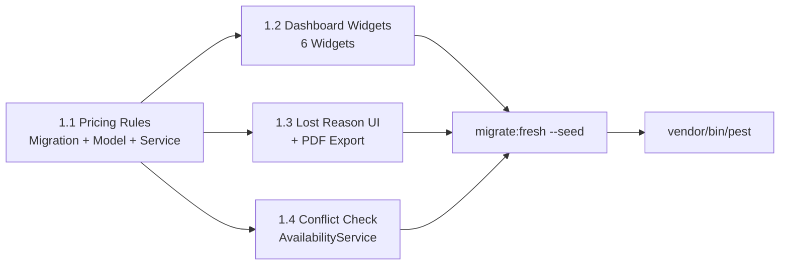

# Kế Hoạch Triển Khai Chi Tiết — LED Manager

> Vì đây là ứng dụng mới, tất cả thay đổi schema sẽ **sửa trực tiếp migration gốc** rồi `migrate:fresh --seed`.

---

## Phase 1 — Nền Tảng Kinh Doanh Cốt Lõi
**Mục tiêu**: Hoàn thiện các chức năng trực tiếp ảnh hưởng đến doanh thu và trải nghiệm người dùng hàng ngày.

### 1.1 Bảng Giá Linh Hoạt (Pricing Rules)

> [!IMPORTANT]
> Hiện tại giá đang hardcode 400,000 VND/tấm/ngày trong `LedCalculationService`. Cần chuyển sang cấu hình động.

#### [NEW] Migration `2026_01_01_000020_create_pricing_rules_table.php`
```php
Schema::create('pricing_rules', function (Blueprint $table) {
    $table->id();
    $table->foreignId('product_line_id')->constrained()->cascadeOnDelete();
    $table->string('customer_type')->nullable();           // individual, agency, corporate — NULL = áp dụng tất cả
    $table->decimal('base_price_per_unit_per_day', 14, 2); // Giá gốc mỗi tấm/ngày
    $table->unsignedInteger('min_days')->default(1);       // Từ ngày thứ mấy áp dụng
    $table->unsignedInteger('max_days')->nullable();       // Đến ngày thứ mấy (NULL = vô hạn)
    $table->decimal('discount_percent', 5, 2)->default(0); // % giảm giá (ngày 2=30%, ngày 3+=50%)
    $table->decimal('crew_rate_per_person_per_day', 14, 2)->default(1600000);
    $table->decimal('transport_rate_per_km', 14, 2)->default(28000);
    $table->decimal('accessory_rate_per_m2', 14, 2)->default(50000);
    $table->boolean('is_active')->default(true);
    $table->timestamps();
});
```

#### Files cần tạo/sửa:
- **[NEW]** `app/Models/PricingRule.php`
- **[MODIFY]** `app/Services/LedCalculationService.php` — `calculatePricing()` lookup `pricing_rules` thay vì hardcode
- **[NEW]** `app/Filament/Resources/PricingRules/*` — CRUD quản lý bảng giá
- **[MODIFY]** `database/seeders/LedOsDataSeeder.php` — seed pricing rules cho P2.6, P1.5

---

### 1.2 Dashboard Widgets (KPI Overview)

> [!IMPORTANT]
> Dashboard hiện tại trống, cần 4-6 widgets KPI.

#### Files cần tạo:
- **[NEW]** `app/Filament/Widgets/RevenueOverviewWidget.php` — Tổng doanh thu tháng (từ `quotations.total_price` status=converted)
- **[NEW]** `app/Filament/Widgets/OrderStatsWidget.php` — Số đơn hàng theo trạng thái (Draft/Dispatched/Returned/Completed)
- **[NEW]** `app/Filament/Widgets/WarehouseUtilizationWidget.php` — Tỷ lệ kho rảnh (assets where status=ready / total assets)
- **[NEW]** `app/Filament/Widgets/QuotationConversionWidget.php` — Tỷ lệ chuyển đổi báo giá → đơn hàng
- **[NEW]** `app/Filament/Widgets/LatestOrdersWidget.php` — 5 đơn hàng gần nhất dạng bảng
- **[NEW]** `app/Filament/Widgets/UpcomingEventsWidget.php` — Sự kiện sắp diễn ra (orders theo request_date)

#### Files cần sửa:
- **[MODIFY]** `app/Filament/Pages/Dashboard.php` — Register widgets

---

### 1.3 Lost Reason UI + Xuất PDF Báo Giá

#### [MODIFY] `app/Filament/Resources/Quotations/Tables/QuotationsTable.php`
- Thêm Action "Từ chối" yêu cầu nhập `lost_reason` khi chuyển status → `rejected`
- Thêm Action "Xuất PDF" export báo giá

#### [NEW] `app/Services/QuotationPdfService.php`
- Render PDF báo giá: logo, thông tin KH, bảng BOM, chi phí, tổng cộng
- Sử dụng `barryvdh/laravel-dompdf` hoặc `spatie/laravel-pdf`

#### [NEW] `resources/views/pdf/quotation.blade.php`
- Template PDF báo giá chuyên nghiệp

---

### 1.4 Kiểm Tra Xung Đột Lịch (Conflict Check)

#### [MODIFY] `app/Filament/Resources/Orders/Schemas/OrderForm.php`
- Thêm validation rule: khi chọn `request_date` + `expected_return_date`, kiểm tra tổng số assets available cho `device_type_id` có đủ `quantity_required` không
- Hiển thị warning nếu thiếu

#### [NEW] `app/Services/AvailabilityService.php`
```php
class AvailabilityService
{
    /** Kiểm tra số assets khả dụng cho device_type trong khoảng ngày */
    public function getAvailableCount(int $deviceTypeId, Carbon $from, Carbon $to, ?int $warehouseId = null): int
    
    /** Kiểm tra xung đột cho toàn bộ BOM của 1 báo giá/đơn hàng */
    public function checkBomConflicts(array $bomItems, Carbon $from, Carbon $to, ?int $warehouseId = null): array
}
```

---

## Phase 2 — Hợp Đồng, Thanh Toán & Lịch
**Mục tiêu**: Hoàn thiện luồng Sales → Contract → Payment.

### 2.1 Quản Lý Hợp Đồng (Contract Management)

#### [NEW] Migration `2026_01_01_000021_create_contracts_table.php`
```php
Schema::create('contracts', function (Blueprint $table) {
    $table->id();
    $table->string('code')->unique();                // HĐ-2608-01
    $table->foreignId('quotation_id')->constrained()->restrictOnDelete();
    $table->foreignId('customer_id')->constrained()->restrictOnDelete();
    $table->foreignId('order_id')->nullable()->constrained()->nullOnDelete();
    
    $table->date('signed_date')->nullable();
    $table->date('start_date')->nullable();
    $table->date('end_date')->nullable();
    
    $table->decimal('contract_value', 14, 2)->default(0);
    $table->decimal('deposit_percent', 5, 2)->default(50);   // % đặt cọc
    $table->decimal('deposit_amount', 14, 2)->default(0);
    
    $table->enum('status', ['draft', 'sent', 'signed', 'active', 'completed', 'cancelled'])->default('draft');
    $table->text('terms')->nullable();               // điều khoản
    $table->text('note')->nullable();
    
    $table->foreignId('created_by')->nullable()->constrained('users')->nullOnDelete();
    $table->timestamps();
    $table->softDeletes();
});
```

#### Files cần tạo:
- **[NEW]** `app/Models/Contract.php`
- **[NEW]** `app/Enums/ContractStatus.php`
- **[NEW]** `app/Filament/Resources/Contracts/*` — full CRUD
- **[MODIFY]** `app/Filament/Resources/Quotations/Tables/QuotationsTable.php` — Action "Tạo Hợp đồng"

---

### 2.2 Thanh Toán & Công Nợ (Payments)

#### [NEW] Migration `2026_01_01_000022_create_payments_table.php`
```php
Schema::create('payments', function (Blueprint $table) {
    $table->id();
    $table->string('code')->unique();                // PAY-2608-01
    $table->foreignId('contract_id')->nullable()->constrained()->nullOnDelete();
    $table->foreignId('order_id')->nullable()->constrained()->nullOnDelete();
    $table->foreignId('customer_id')->constrained()->restrictOnDelete();
    
    $table->enum('type', ['deposit', 'partial', 'final', 'refund'])->default('deposit');
    $table->enum('method', ['cash', 'bank_transfer', 'other'])->default('bank_transfer');
    $table->decimal('amount', 14, 2);
    $table->date('payment_date');
    $table->string('reference')->nullable();         // Số hoá đơn / Số GD ngân hàng
    $table->text('note')->nullable();
    
    $table->foreignId('received_by')->nullable()->constrained('users')->nullOnDelete();
    $table->timestamps();
});
```

#### Files cần tạo:
- **[NEW]** `app/Models/Payment.php`
- **[NEW]** `app/Enums/PaymentType.php`, `app/Enums/PaymentMethod.php`
- **[NEW]** `app/Filament/Resources/Payments/*` — full CRUD
- **[NEW]** `app/Filament/Widgets/DebtOverviewWidget.php` — Công nợ tồn đọng

---

### 2.3 Lịch Cho Thuê (Booking Calendar)

#### [NEW] `app/Filament/Widgets/BookingCalendarWidget.php`
- Sử dụng Filament Calendar plugin (`saade/filament-fullcalendar`)
- Hiển thị Orders dưới dạng event trên calendar
- Màu sắc theo status (draft=gray, dispatched=blue, returned=green)
- Click vào event → redirect đến trang Edit Order

---

## Phase 3 — Vận Hành, Nhân Sự & Báo Cáo
**Mục tiêu**: Nâng cao hiệu quả vận hành hiện trường và cung cấp insights.

### 3.1 Phân Công Kỹ Thuật Viên

#### [NEW] Migration `2026_01_01_000023_create_event_assignments_table.php`
```php
Schema::create('event_assignments', function (Blueprint $table) {
    $table->id();
    $table->foreignId('order_id')->constrained()->cascadeOnDelete();
    $table->foreignId('user_id')->constrained()->cascadeOnDelete();
    $table->enum('role', ['lead', 'technician', 'driver', 'helper'])->default('technician');
    $table->date('start_date')->nullable();
    $table->date('end_date')->nullable();
    $table->text('note')->nullable();
    $table->timestamps();
    
    $table->unique(['order_id', 'user_id']);
});
```

#### Files cần tạo:
- **[NEW]** `app/Models/EventAssignment.php`
- **[NEW]** `app/Enums/AssignmentRole.php`
- **[MODIFY]** `app/Models/Order.php` — thêm `assignments()` relationship
- **[MODIFY]** `app/Filament/Resources/Orders/Schemas/OrderForm.php` — thêm Repeater phân công KTV trong form đơn hàng

---

### 3.2 Lịch Trình Thi Công (Event Timeline)

#### [NEW] Migration `2026_01_01_000024_create_event_milestones_table.php`
```php
Schema::create('event_milestones', function (Blueprint $table) {
    $table->id();
    $table->foreignId('order_id')->constrained()->cascadeOnDelete();
    $table->enum('type', ['delivery', 'setup', 'testing', 'event_start', 'event_end', 'teardown', 'pickup']);
    $table->dateTime('planned_at');
    $table->dateTime('actual_at')->nullable();
    $table->enum('status', ['pending', 'in_progress', 'completed', 'skipped'])->default('pending');
    $table->text('note')->nullable();
    $table->timestamps();
});
```

#### Files cần tạo:
- **[NEW]** `app/Models/EventMilestone.php`
- **[NEW]** `app/Enums/MilestoneType.php`, `app/Enums/MilestoneStatus.php`
- **[MODIFY]** `app/Models/Order.php` — thêm `milestones()` relationship

---

### 3.3 Checklist Bàn Giao

#### [MODIFY] Migration `2026_01_01_000015_create_checkout_batch_items_table.php`
Bổ sung các cột checklist vào `checkout_batch_items`:
```php
$table->boolean('checked_brightness')->default(false);
$table->boolean('checked_dead_pixels')->default(false);
$table->boolean('checked_color')->default(false);
$table->boolean('checked_power')->default(false);
$table->text('checklist_note')->nullable();
```

---

### 3.4 Báo Cáo Nâng Cao

#### Files cần tạo:
- **[NEW]** `app/Filament/Resources/Reports/RevenueReportPage.php` — Báo cáo doanh thu theo tháng/quý/năm, theo dịch vụ, theo Sales
- **[NEW]** `app/Filament/Resources/Reports/AssetUtilizationReportPage.php` — Tỷ lệ khai thác theo dòng sản phẩm
- **[NEW]** `app/Filament/Resources/Reports/RepairFrequencyReportPage.php` — Tần suất lỗi theo thương hiệu/lô
- **[NEW]** `app/Filament/Resources/Reports/SalesConversionReportPage.php` — Tỷ lệ chuyển đổi báo giá
- **[NEW]** `app/Filament/Resources/Reports/EventPnlReportPage.php` — Lãi lỗ từng sự kiện

> Tất cả report pages sử dụng Filament Tables + Chart Widgets, không cần model mới.

---

## Phase 4 — Tính Năng Chuyên Sâu
**Mục tiêu**: Tính năng nâng cao, có thể triển khai sau khi core business ổn định.

### 4.1 Khấu Hao Tài Sản

#### [MODIFY] Migration `2026_01_01_000005_create_assets_table.php`
Bổ sung cột:
```php
$table->decimal('accumulated_depreciation', 14, 2)->default(0);
$table->unsignedInteger('useful_life_months')->nullable()->default(60); // 5 năm
$table->enum('depreciation_method', ['straight_line', 'usage_based'])->default('straight_line');
```

#### Files cần tạo:
- **[NEW]** `app/Services/DepreciationService.php` — Artisan command chạy hàng tháng tính khấu hao
- **[NEW]** `app/Console/Commands/CalculateDepreciationCommand.php`

### 4.2 Digital Signage / LED Control

> [!NOTE]
> Đây là module hoàn toàn độc lập, phục vụ LED quảng cáo cố định. **Khuyến nghị tách thành package riêng hoặc phase sau cùng** khi các chức năng core đã ổn định.

---

## Tổng Hợp Files Theo Phase

| Phase | Migrations Mới | Models Mới | Enums Mới | Resources/Pages Mới | Widgets Mới | Services Mới |
|---|---|---|---|---|---|---|
| **1** | 1 | 1 | 0 | 1 | 6 | 2 |
| **2** | 2 | 2 | 3 | 2 | 2 | 0 |
| **3** | 2 | 2 | 3 | 5 (Pages) | 0 | 0 |
| **4** | 0 (modify) | 0 | 0 | 0 | 0 | 1 |
| **Tổng** | **5** | **5** | **6** | **8** | **8** | **3** |

---

## Thứ Tự Thực Hiện Phase 1



## Verification Plan

### Automated Tests
- `php artisan migrate:fresh --seed` — Database seed thành công
- `vendor/bin/pest` — Tất cả test hiện tại vẫn pass
- Thêm test mới cho: `PricingRuleTest`, `AvailabilityServiceTest`, `ContractCreationTest`, `PaymentTrackingTest`

### Manual Verification
- Kiểm tra Dashboard widgets hiển thị đúng KPI
- Tạo báo giá → xuất PDF → kiểm tra format
- Tạo 2 đơn hàng trùng ngày → xác nhận cảnh báo conflict

> **Bạn muốn bắt đầu từ Phase nào? Hay duyệt Phase 1 trước rồi tiến hành?**
