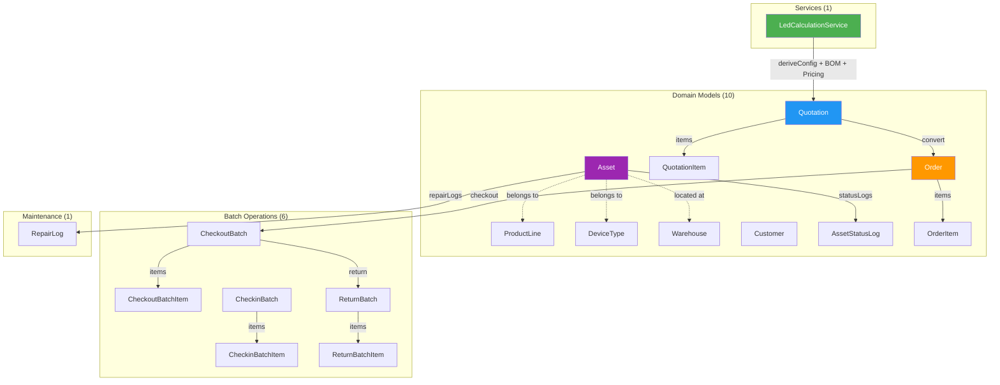

# 📊 Đối Chiếu Project LED Manager vs. Tài Liệu Yêu Cầu Chức Năng

> **Phương pháp**: Đọc 4 file docs (`Tổng quan`, `Quản lý kho`, `Quản lý Báo giá`, `Báo cáo`) → Dùng `codegraph` phân tích 247 files, 9,795 nodes, 36,207 edges → Đối chiếu từng yêu cầu.

---

## Tóm Tắt Nhanh

| Nhóm Chức Năng | Đã Có | Có 1 Phần | Chưa Có |
|---|---|---|---|
| 1. Quản lý Kho & Thiết bị | 8 | 2 | 3 |
| 2. Báo giá, Hợp đồng & Đơn hàng | 7 | 2 | 5 |
| 3. Vận hành & Nhân sự sự kiện | 0 | 1 | 3 |
| 4. Tài chính & Công nợ | 0 | 1 | 2 |
| 5. Trình chiếu & Điều khiển từ xa | 0 | 0 | 3 |
| 6. Báo cáo & Phân tích | 0 | 1 | 6 |
| **Tổng** | **15** | **7** | **22** |

**Đánh giá tổng thể: ~34% hoàn thành (15/44 chức năng), ~50% nếu tính cả phần đã có 1 phần (22/44).**

---

## 1. Quản Lý Kho & Thiết Bị (Inventory Management)

### ✅ ĐÃ CÓ

| # | Yêu Cầu Docs | Hiện Trạng Code | Files Liên Quan |
|---|---|---|---|
| 1.1 | Phân loại theo Module/Cabinet (P2.5, P3.91...) | `ProductLine` model + `DeviceType` model phân loại đầy đủ theo code (P2.6, P1.5...) | [ProductLine.php](file:///Users/cuongpham/Deverlop/Laravel/led-manager/app/Models/ProductLine.php), [DeviceType.php](file:///Users/cuongpham/Deverlop/Laravel/led-manager/app/Models/DeviceType.php) |
| 1.2 | Mã hóa Serial/QR Code mỗi thiết bị | `Asset.serial_no` + `Asset.qr_code` | [Asset.php](file:///Users/cuongpham/Deverlop/Laravel/led-manager/app/Models/Asset.php) |
| 1.3 | BOM tự động quy đổi diện tích → linh kiện | `LedCalculationService.generateBom()` tính 11 dòng BOM từ width × height | [LedCalculationService.php](file:///Users/cuongpham/Deverlop/Laravel/led-manager/app/Services/LedCalculationService.php) |
| 1.4 | Trạng thái 5 mức: Sẵn sàng/Sự kiện/Vận chuyển/Bảo trì/Thanh lý | `AssetStatus` enum: Ready, InEvent, InTransit, Repairing, Disposed | [AssetStatus.php](file:///Users/cuongpham/Deverlop/Laravel/led-manager/app/Enums/AssetStatus.php) |
| 1.5 | Quản lý kho đa điểm | `Warehouse` model, `Asset.current_warehouse_id` | [Warehouse.php](file:///Users/cuongpham/Deverlop/Laravel/led-manager/app/Models/Warehouse.php) |
| 1.6 | Quy trình Xuất kho (Check-out) | `CheckoutBatch` + `CheckoutBatchItem` (quét mã → xuất kho) | [CheckoutBatch.php](file:///Users/cuongpham/Deverlop/Laravel/led-manager/app/Models/CheckoutBatch.php) |
| 1.7 | Quy trình Nhập kho (Check-in) | `CheckinBatch` + `CheckinBatchItem` | [CheckinBatch.php](file:///Users/cuongpham/Deverlop/Laravel/led-manager/app/Models/CheckinBatch.php) |
| 1.8 | Hoàn trả sau sự kiện (Return Inspection) | `ReturnBatch` + `ReturnBatchItem` + `ReturnGrade` enum phân loại tình trạng | [ReturnBatch.php](file:///Users/cuongpham/Deverlop/Laravel/led-manager/app/Models/ReturnBatch.php), [ReturnGrade.php](file:///Users/cuongpham/Deverlop/Laravel/led-manager/app/Enums/ReturnGrade.php) |

### 🟡 CÓ 1 PHẦN

| # | Yêu Cầu Docs | Hiện Trạng | Thiếu Gì |
|---|---|---|---|
| 1.9 | Lưu lịch sử sửa chữa + cảnh báo bảo trì định kỳ | `RepairLog` model có ghi lịch sử lỗi, chi phí sửa chữa, kết quả | **Chưa có** cảnh báo bảo trì định kỳ tự động (scheduled reminders dựa trên giờ vận hành hoặc số sự kiện) |
| 1.10 | Kiểm tra trùng lịch (Conflict Check) | `Order` có `request_date` + `expected_return_date` | **Chưa có** logic kiểm tra xung đột khi đặt thiết bị trùng ngày |

### ❌ CHƯA CÓ

| # | Yêu Cầu Docs | Ghi Chú |
|---|---|---|
| 1.11 | Tính toán khấu hao tài sản (Depreciation) | Không có model/service nào tính khấu hao theo thời gian hoặc tần suất sử dụng |
| 1.12 | Đề xuất chuyển kho nội bộ khi thiếu hàng | Không có logic auto-suggest warehouse transfer |
| 1.13 | Quét QR/Barcode bằng mobile | Có trường `qr_code` nhưng chưa có API/endpoint scan QR từ mobile |

---

## 2. Quản Lý Báo Giá, Hợp Đồng & Đơn Hàng (Sales & Orders)

### ✅ ĐÃ CÓ

| # | Yêu Cầu Docs | Hiện Trạng Code | Files Liên Quan |
|---|---|---|---|
| 2.1 | Tự động quy đổi kích thước → số cabinet, processor, tải trọng, công suất | `LedCalculationService.deriveConfiguration()` tính đầy đủ | [LedCalculationService.php](file:///Users/cuongpham/Deverlop/Laravel/led-manager/app/Services/LedCalculationService.php) |
| 2.2 | Tính chi phí nhân công, vận chuyển, phụ kiện | `calculatePricing()` tính equipment_rental, crew_labour, transport, accessory | [LedCalculationService.php](file:///Users/cuongpham/Deverlop/Laravel/led-manager/app/Services/LedCalculationService.php) |
| 2.3 | Tự động tính biên lợi nhuận | `margin_percent` = (price - cost) / price × 100 | [QuotationForm.php](file:///Users/cuongpham/Deverlop/Laravel/led-manager/app/Filament/Resources/Quotations/Schemas/QuotationForm.php) |
| 2.4 | Theo dõi trạng thái báo giá (Draft → Sent → Approved → Converted → Rejected) | `QuotationStatus` enum: Draft, Sent, Approved, Converted, Rejected, Expired | [QuotationStatus.php](file:///Users/cuongpham/Deverlop/Laravel/led-manager/app/Enums/QuotationStatus.php) |
| 2.5 | Chuyển đổi Báo giá → Đơn hàng | Action "Chuyển thành Đơn hàng" trong `QuotationsTable`, copy BOM → OrderItems | [QuotationsTable.php](file:///Users/cuongpham/Deverlop/Laravel/led-manager/app/Filament/Resources/Quotations/Tables/QuotationsTable.php) |
| 2.6 | Quản lý Đơn hàng với trạng thái | `OrderStatus`: Draft, OutboundCreated, Dispatched, Returned, Completed, Cancelled | [OrderStatus.php](file:///Users/cuongpham/Deverlop/Laravel/led-manager/app/Enums/OrderStatus.php) |
| 2.7 | Phân loại khách hàng | `CustomerType` enum phân loại nhóm KH | [CustomerType.php](file:///Users/cuongpham/Deverlop/Laravel/led-manager/app/Enums/CustomerType.php) |

### 🟡 CÓ 1 PHẦN

| # | Yêu Cầu Docs | Hiện Trạng | Thiếu Gì |
|---|---|---|---|
| 2.8 | Cơ chế giá linh hoạt (giảm dần theo ngày, bảng giá riêng) | Hiện tại giá cố định 400,000 VND/tấm/ngày hardcode trong Service | **Cần** bảng `pricing_rules` hoặc cấu hình giá linh hoạt cho từng ProductLine, theo số ngày, theo nhóm khách |
| 2.9 | Ghi nhận lý do mất đơn (Lost Deal Reason) | `Quotation.lost_reason` fillable đã có | **Chưa có** UI/form field để nhập lý do khi chuyển sang Rejected |

### ❌ CHƯA CÓ

| # | Yêu Cầu Docs | Ghi Chú |
|---|---|---|
| 2.10 | Xuất báo giá PDF/Excel chuyên nghiệp | Không có action export PDF/Excel |
| 2.11 | Quản lý Hợp đồng (Contract Management) | Không có model `Contract`, không có ký số, điều khoản đặt cọc |
| 2.12 | Lịch cho thuê dạng Calendar/Gantt (Booking Calendar) | Dashboard hiện tại trống, không có widget calendar |
| 2.13 | Khóa giữ kho (Soft Lock / Hard Lock) | Không có logic reservation/holding |
| 2.14 | Quản lý yêu cầu thay đổi đơn hàng (Change Order) | Không có model/form phụ lục điều chỉnh |

---

## 3. Quản Lý Vận Hành & Nhân Sự Sự Kiện (Event Logistics)

### 🟡 CÓ 1 PHẦN

| # | Yêu Cầu Docs | Hiện Trạng | Thiếu Gì |
|---|---|---|---|
| 3.1 | Phân công đội ngũ kỹ thuật | `Order.sales_user_id`, `CheckoutBatch.created_by` liên kết User | **Chưa có** bảng phân công nhiều kỹ thuật viên cho 1 sự kiện (event_crew/assignments) |

### ❌ CHƯA CÓ

| # | Yêu Cầu Docs | Ghi Chú |
|---|---|---|
| 3.2 | Lịch trình thi công (Timeline) | Không có model/UI quản lý mốc thời gian giao hàng, setup, test, tháo dỡ |
| 3.3 | Checklist bàn giao chất lượng | Không có model checklist kiểm tra độ sáng, điểm chết, màu sắc |
| 3.4 | Theo dõi xe vận chuyển | Không có logistics tracking |

---

## 4. Quản Lý Tài Chính & Công Nợ (Finance & Accounting)

### 🟡 CÓ 1 PHẦN

| # | Yêu Cầu Docs | Hiện Trạng | Thiếu Gì |
|---|---|---|---|
| 4.1 | Theo dõi giá trị đơn hàng | `Order.value`, `Quotation.total_price` | **Chưa có** quản lý đặt cọc, thanh toán theo đợt, công nợ |

### ❌ CHƯA CÓ

| # | Yêu Cầu Docs | Ghi Chú |
|---|---|---|
| 4.2 | Quản lý cọc & Thanh toán theo đợt | Không có model `Payment`/`Deposit`/`Invoice` |
| 4.3 | Báo cáo doanh thu - chi phí theo sự kiện | Không có report tính lãi lỗ per event |

---

## 5. Quản Lý Trình Chiếu & Điều Khiển Từ Xa (Digital Signage / LED Control)

> [!NOTE]
> Nhóm chức năng này hoàn toàn **chưa được triển khai**. Đây là tính năng nâng cao dành cho LED quảng cáo cố định.

### ❌ CHƯA CÓ

| # | Yêu Cầu Docs |
|---|---|
| 5.1 | Lập lịch phát nội dung (Scheduling playlist) |
| 5.2 | Giám sát thiết bị từ xa (Remote Monitoring Cloud) |
| 5.3 | Phân quyền cho khách tự upload nội dung |

---

## 6. Báo Cáo & Phân Tích (Analytics & Reporting)

### 🟡 CÓ 1 PHẦN

| # | Yêu Cầu Docs | Hiện Trạng | Thiếu Gì |
|---|---|---|---|
| 6.1 | Lịch sử chuyển động thiết bị | `AssetStatusLog` resource thuộc nhóm "Reports" | **Chưa có** dashboard/chart thống kê trực quan |

### ❌ CHƯA CÓ

| # | Yêu Cầu Docs | Ghi Chú |
|---|---|---|
| 6.2 | Tỷ lệ khai thác kho (Utilization Rate) | Không có widget/report |
| 6.3 | Điểm hòa vốn ROI (ROI Tracker) | Không có tính toán ROI per lô thiết bị |
| 6.4 | Phân tích tần suất lỗi theo thương hiệu/lô | Không có aggregation report từ RepairLog |
| 6.5 | Báo cáo doanh thu đa chiều | Không có report doanh thu theo thời gian/service/sales/customer |
| 6.6 | Tỷ lệ chuyển đổi báo giá (Conversion Rate) | Không có stats Quotation → Order conversion |
| 6.7 | Executive Dashboard (KPI đồ thị) | Dashboard hiện tại trống, không có Filament Widget nào |

---

## Sơ Đồ Kiến Trúc Hiện Tại (từ CodeGraph)

---

## 🎯 Khuyến Nghị Ưu Tiên Phát Triển Tiếp

> [!IMPORTANT]
> Dựa trên giá trị kinh doanh và khối lượng code cần bổ sung, tôi đề xuất thứ tự ưu tiên:

### Phase 1 — Quick Wins (Bổ sung vào codebase hiện tại)
1. **Dashboard Widgets** — Thêm Filament Widgets cho KPI: Tổng doanh thu, Số đơn hàng, Tỷ lệ kho rảnh
2. **Lost Deal Reason UI** — Thêm form field cho `lost_reason` khi chuyển báo giá sang Rejected
3. **Xuất PDF Báo giá** — Action export PDF từ QuotationResource
4. **Kiểm tra xung đột lịch** — Logic conflict check khi tạo Order mới

### Phase 2 — Core Business Logic
5. **Bảng giá linh hoạt** — Model `PricingRule` với giá theo ngày/nhóm khách/ProductLine
6. **Quản lý Hợp đồng** — Model `Contract` liên kết Quotation → Contract → Order
7. **Thanh toán & Công nợ** — Model `Payment`, `Invoice`, theo dõi đặt cọc

### Phase 3 — Advanced Features
8. **Booking Calendar** — Filament Calendar Widget cho lịch thuê
9. **Báo cáo Doanh thu & Lợi nhuận** — Chart reports đa chiều
10. **Phân công Kỹ thuật viên** — Model `EventAssignment`

### Phase 4 — Specialist Modules (Có thể tách riêng)
11. **Khấu hao tài sản**
12. **Digital Signage / LED Control** (nếu cần)

> Bạn muốn tiến hành phase nào trước?
